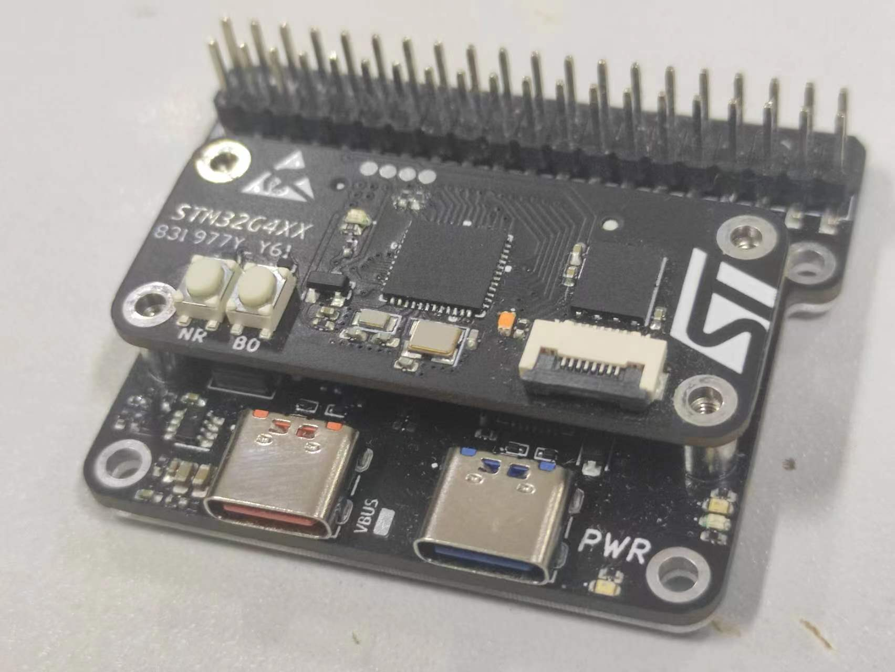
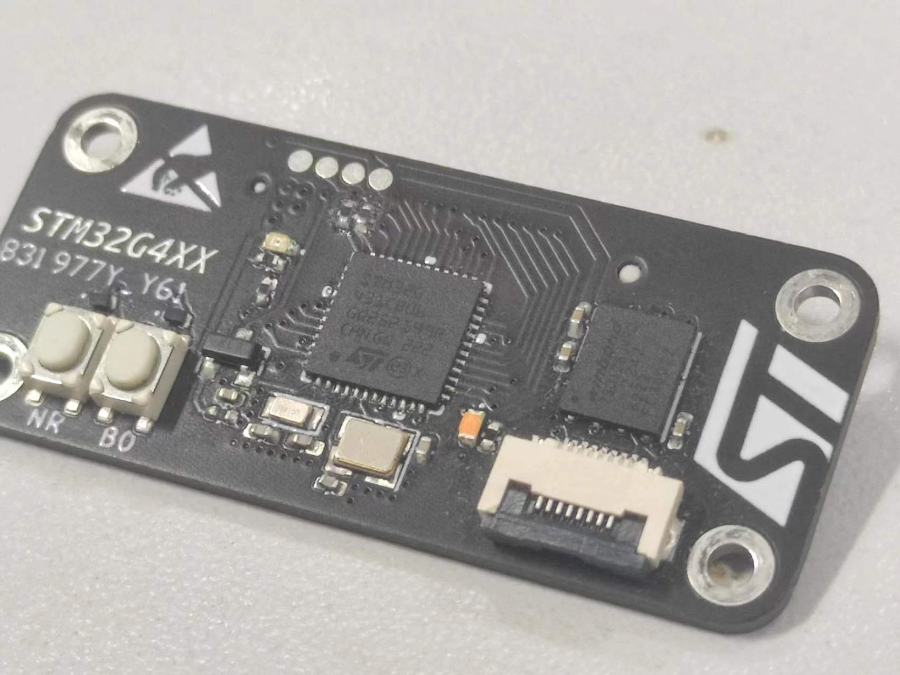
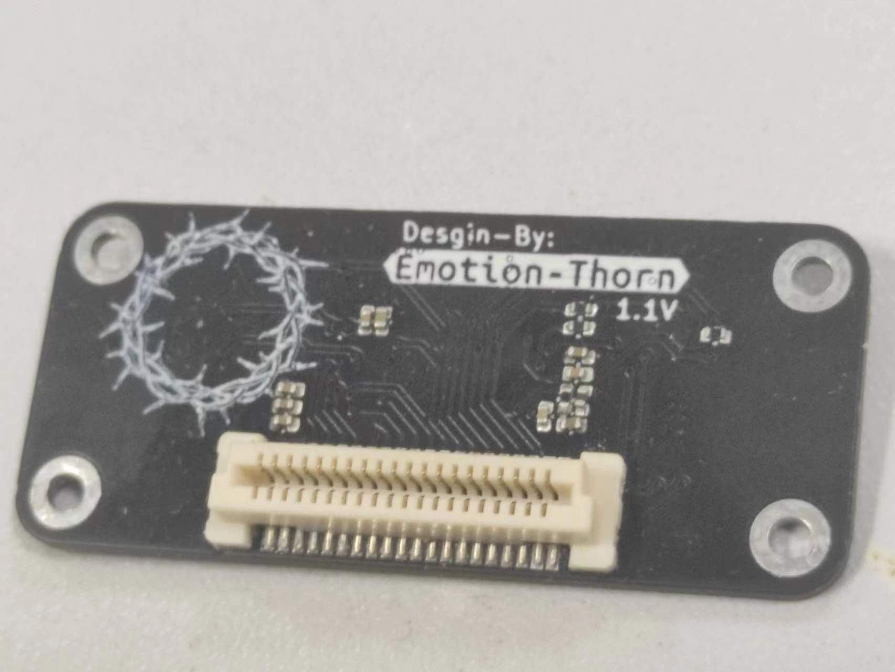
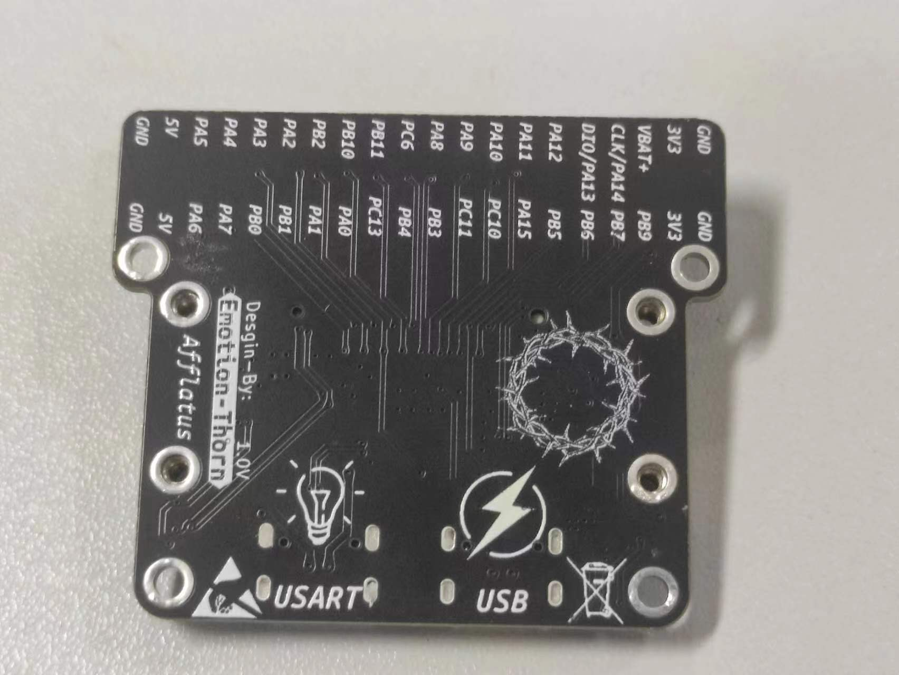

# Afflatus💡
           
* [**中文版本**](./README_zh.md)
## Afflatus STM32G4xx Open Development Board🚀
* This project used STM32G431 to master chip.A complete board to be made up of **Commaner**+**Expansion**
>`STM32G431CBU6` Core Board

## Commander✨📟

|Top|Bottom|
|:--:|:--:|
||

>At present core boaed onboard Flash,LED,NRST and BOOT0 keys,Reserved serial interface of LDC,Need`0.8mm wire the connection`

>Commander have used `0.8mm`BTB_2x20P，`Not connected to Expansion`Download program can use reserved SW bonding pad to connected `Cable`or`Test probe`Download program

>Commander`none the LDO and DC-DC to buck`,to the extent that core board power only give`3.3V`❗ ❗ ❗

## Expansion🔌⚡🚀

|Top|Bottom|
|:--:|:--:|
||

* 1 USB support PD
* 1 USART to USB port
* 1 IMU(BMI270)
* 1 40P header 

>Expansion have one`CP2102`USB can be connected for serial communication.STM32G431CBU6 support `UCPD`so the USB plug support PD and have one DC-DC buck module⚡

>Consider that newbies may be less likely to use the STM32's built-in USB hardware controls,so i reserved USB_D+ pull-up R CC1,CC2 pull-down R`0402`bonding pad,it's recommended to weld pull-down R for CC1 and CC2🔌

>Expansion the type of embedded stud is`M2x4x5.0x2.5x1.0`,BTB combined height is`5.0mm`
I/O Pin header is 2.54mm`SMT`.Optionally add baseplate for Expansion,[**Baseplate file**](./HDK/Expansion/Choice.dxf)effect maps

## Important statement ❗ ❗ ❗

*  ⚠️Please read the PCB Engineering Instructions pdf file
    - 📖[Engineering declaration](./%E5%B7%A5%E7%A8%8B%E5%A3%B0%E6%98%8E.pdf)
* 👓The whole project uses a two-layer process. If you don't have kicad installed, you can directly view Bom for welding. Gerber files are also in HDK
    - [**Commander-bom**](./HDK/Commander/bom/Commander.html)
    - [**Expansion-bom**](./HDK/Expansion/bom/Expansion.html)
*  I E-mail**2981263629@qq.com**,if you have questions or new idea can send an email to me⌨
