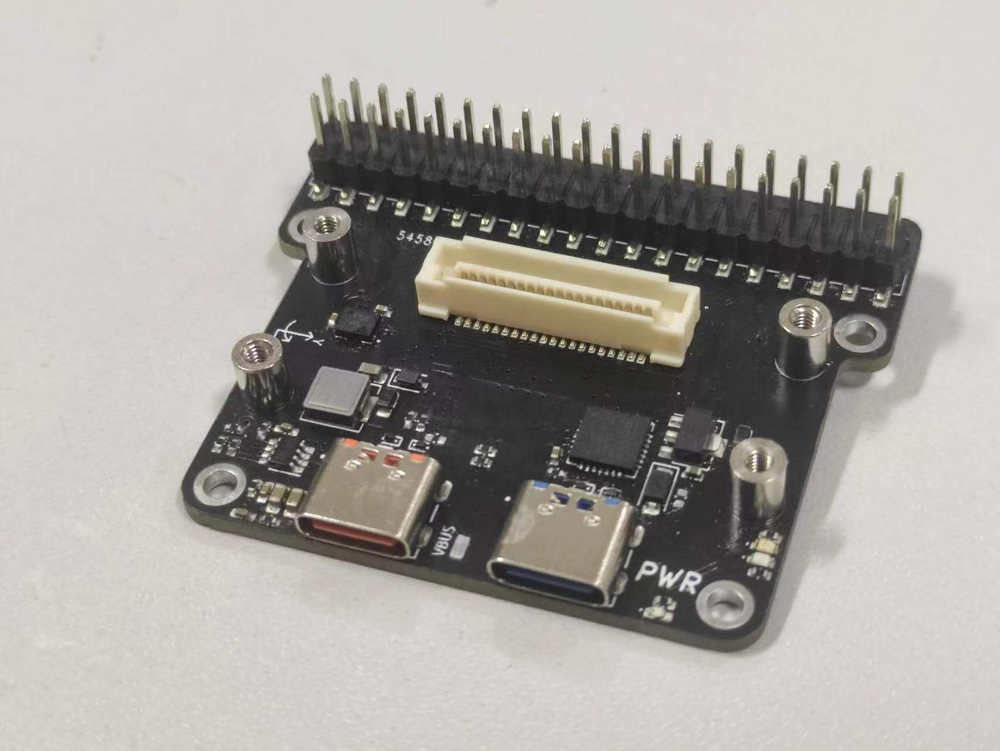
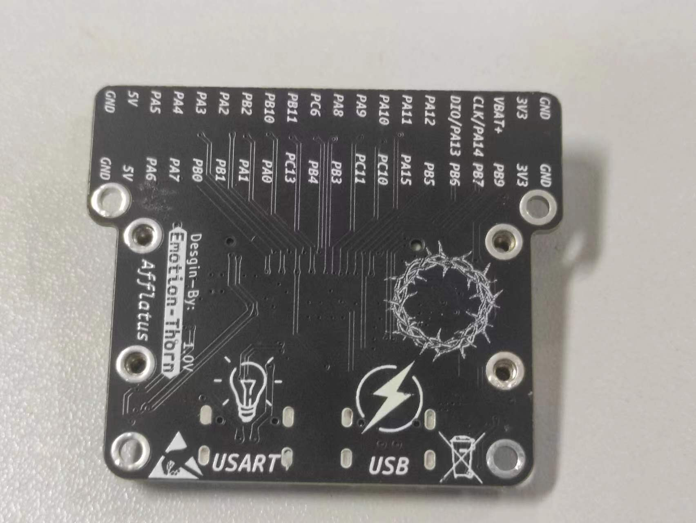
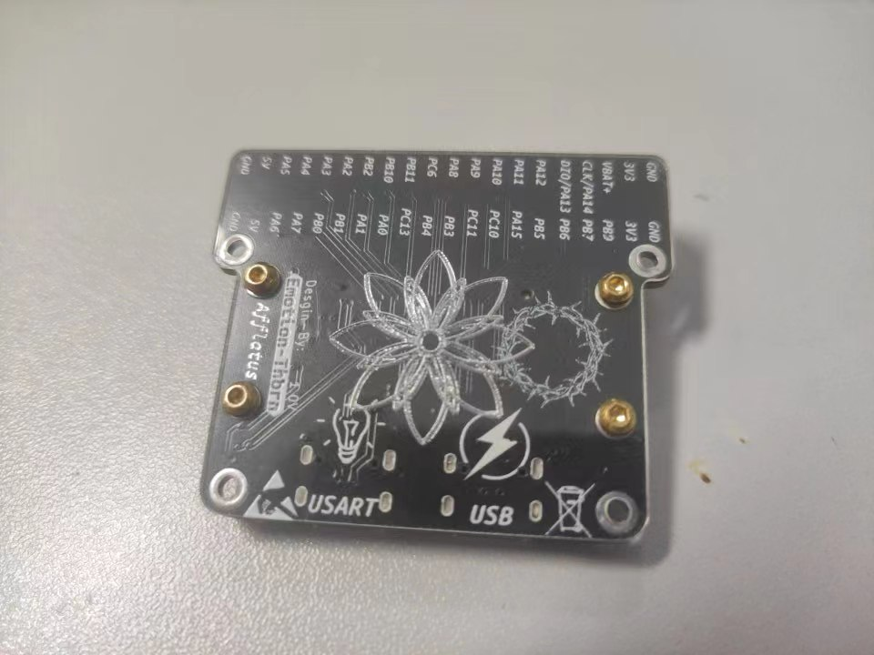

# Afflatus💡
           
* [**English Version**](./README.md)
## Afflatus STM32G4xx开源开发板🚀
* 本次工程使用STM32G431CBU6作为主芯片。通过核心板(**Commaner**)+拓展板(**Expansion**)组成完整开发板
>`STM32G431CBU6` Core Board

## Commander✨📟

|Top|Bottom|
|:--:|:--:|
||

>目前核心板板载了Flash,LED,NRST和BOOT0按键，预留了串行LCD的接口,需要`0.8mm排线进行连接`

>Commander使用了`0.8mm`的BTB_2x20P，在`没有连接Expansion`下载程序时可以通过预留SW焊盘焊接`杜邦线`或者接`测试探针`进行下载

>Commander`没有板载LDO和DC-DC降压`,因此对于核心板单独供电是只能接`3.3V`❗ ❗ ❗

## Expansion🔌⚡🚀

|Top|Bottom|
|:--:|:--:|
||

* 1个USB支持PD
* 1个USART转USB接口
* 1个IMU(BMI270)
* 1个40P排针 

>Expansion有一个`CP2102`可以连接usb进行串口通信。STM32G431CBU6支持`UCPD`所以USB接口支持PD同时拥有一个DC-DC降压模块⚡

>考虑到新手可能不太会用STM32自带的USB硬件控制,所以预留了USBD+上拉电阻CC1,CC2下拉电阻`0402`的焊盘,建议制作时同时焊接CC1和CC2的下拉电阻🔌

>Expansion上嵌入式螺柱的型号是`M2x4x5.0x2.5x1.0`,BTB的合高为`5.0mm`
I/O引出排针为2.54mm`贴片`.可以选择为Expansion添加亚克力透明底板,[**亚克力文件**](./HDK/Expansion/Choice.dxf)下面是效果图

## 重要声明 ❗ ❗ ❗

*  ⚠️请阅读PCB工程须知pdf文件
    - 📖[工程声明](./%E5%B7%A5%E7%A8%8B%E5%A3%B0%E6%98%8E.pdf)
* 👓全工程使用的是两层工艺,如果没有装kicad的小伙伴可以直接查看Bom进行焊接，Gerber文件也在HDK中
    - [**Commander-bom**](./HDK/Commander/bom/Commander.html)
    - [**Expansion-bom**](./HDK/Expansion/bom/Expansion.html)
* 工程持续更新，目前在补充Demo.📃
* 欢迎各位小伙伴踊跃提出问题，同样也希望各位可以提交自己对项目的更新📡
* 本人最近比较忙UCPD还没有进行测试，但是USB功能是正常(已经测试)，UCPD使用说明在->./Afflatus/HDK/Design-Flie中，往后要是有小伙伴搞出了UCPD或者我有时间进行补充，我会第一时间进行提交。
* 本人E-mail**2981263629@qq.com**,如果有疑问或者新的点子可以发邮件给我⌨
* ❗ ❗ ❗ 重要 ❗ ❗ ❗ 如果你clone的是比较早的那个版本IO丝印有问题（有部分丝印反向了）不影响使用。目前正确版本是amend silk-screen ❗ ❗ ❗
