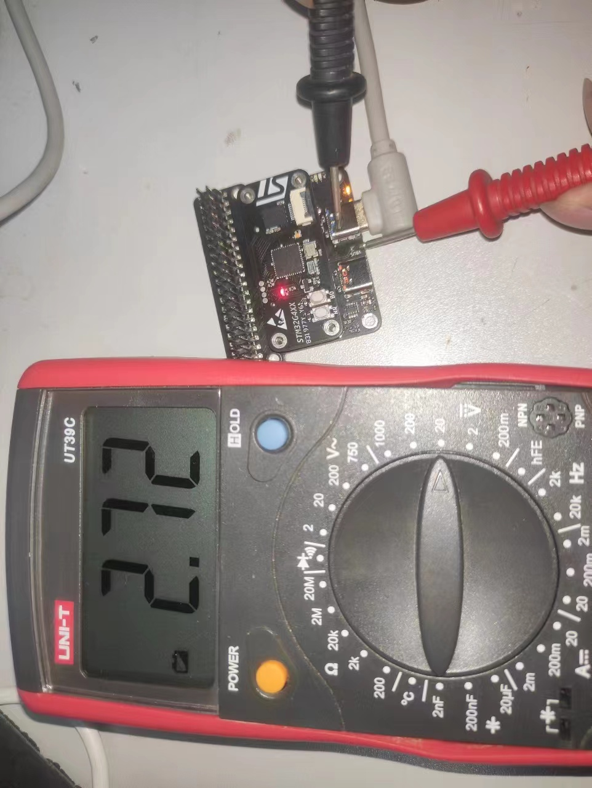
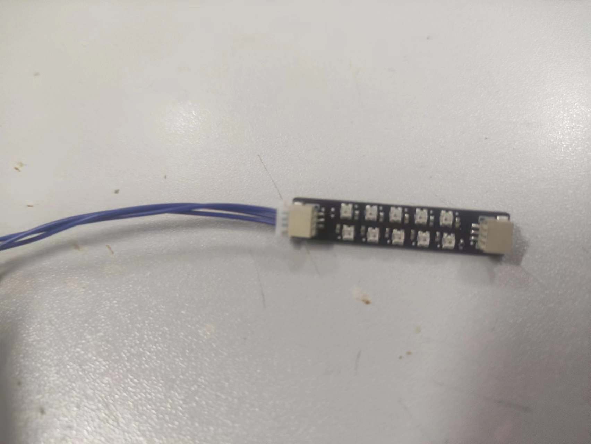
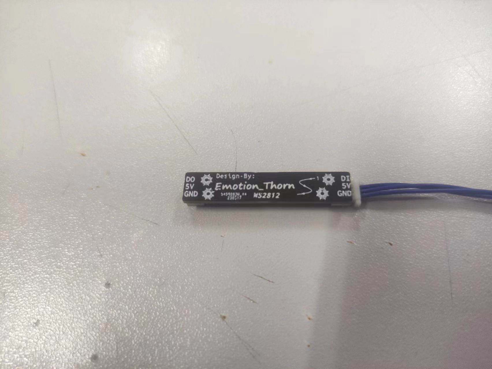

# About Demo 
## ADC NOTE:
> In ADC_Demo VBUS value may not be accurate.Becuase this value from resistance divider.In fact, it should be use float when you calculate it ,but this demo i use int.

>If you just put in USART ,there is also voltage in VBUS(about2.7v). 

|
## WS2812 NOTE:
>In WS2812 Demo i used WS2812B.If you don't have a light strip, you can get the data in hdk
|
## In this File you use DSP of Afflatus API 
## Support Feature List👇
* Flash(W25Qxx)  [**Help Document**](./Doc/W25Qxx.pdf)👈
* ADC is used STM_HAL
* RGB(WS2812)[**Help Document**](./Doc/W25Qxx.pdf)👈