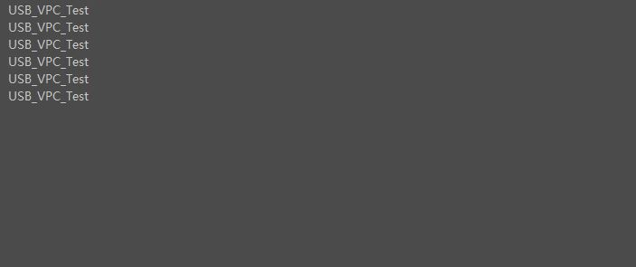
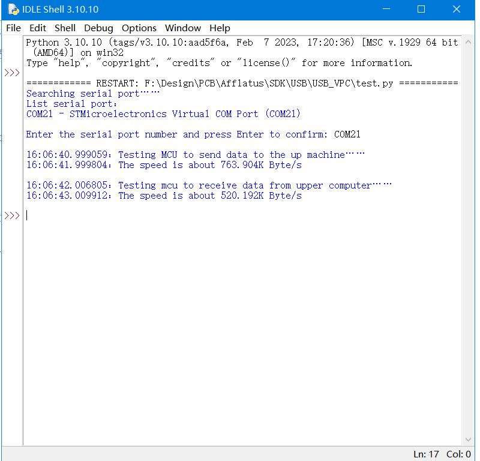

># USB_VPC
>* Download this program,In your SSCOM can see word "USB_VPC_Test"

>* If you want to test usb_vpc speed,Use file test.py and input Serial Port Start Test 
>* In this example if you want to use VPC like usart use printf()you need use `usb_printf();`
>* If you want to close usb_vpc speed,in `main.h` find `USB_VPC_SPEED_TEST`